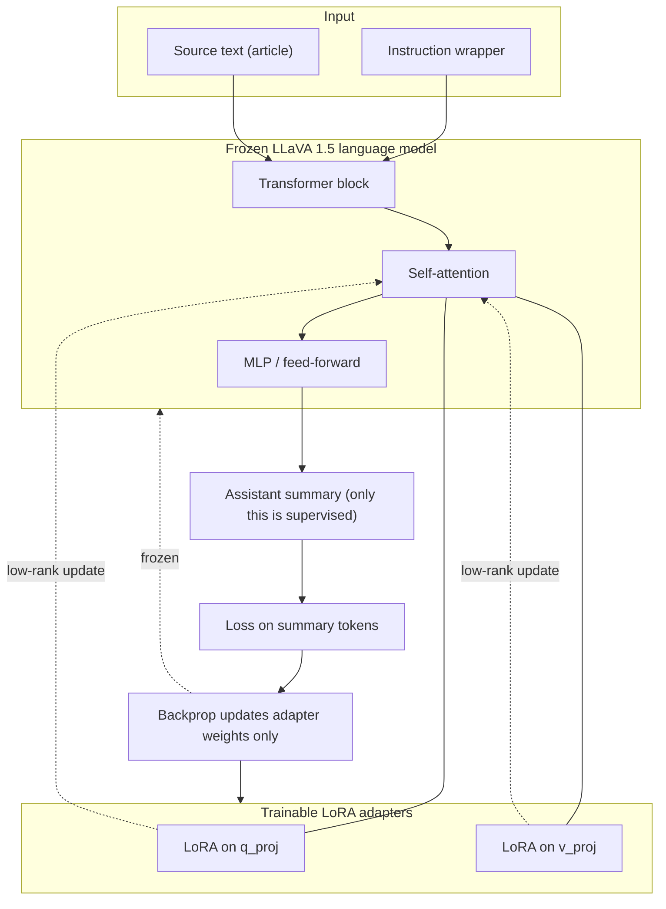
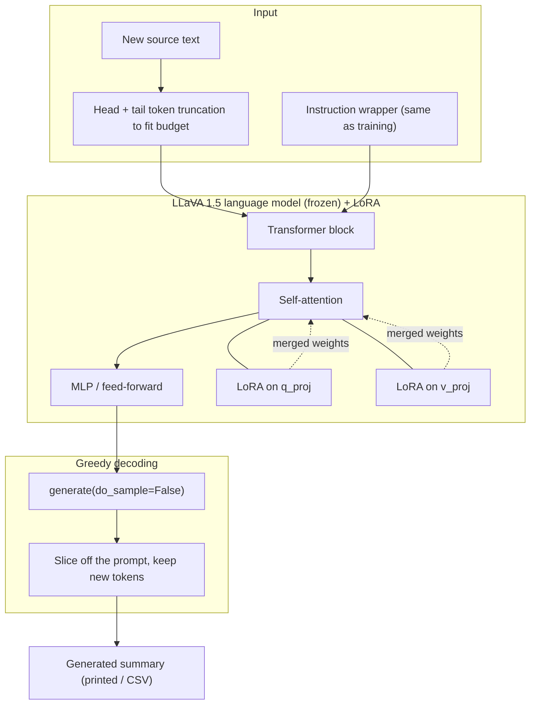

# llava15-lm-lora

LoRA fine-tuning of the **language-model backbone** inside `llava-hf/llava-1.5-7b-hf`
on plain text/summary pairs. No images are used anywhere in this pipeline —
see [What "LM" means here](#what-lm-means-here-and-why-its-not-a-vlm-fine-tune)
below for why that matters and why this folder isn't called `llava15-lora`.

**Task:** given an article's raw text, produce a new one-paragraph summary.
Loss is computed only on the summary, and long input is truncated by tokens
(head + tail) so the summary is always preserved in the training budget.

**Data:** CNN/DailyMail article/summary pairs, downloaded locally as Parquet.
This repo does not download CNN/DailyMail itself; it only trains on the files
once you've fetched them. All downloads, cache, checkpoints, and adapters
stay inside this folder.

## What "LM" means here, and why it's not a VLM fine-tune

`llava-hf/llava-1.5-7b-hf` is a **vision-language model**: a CLIP vision
encoder → a multimodal projector → a Vicuna-7B language-model backbone
(itself a Llama-architecture decoder-only LLM). That's the full LLaVA
architecture.

This pipeline trains **only the language-model backbone**:

- LoRA adapters are applied to `q_proj`/`v_proj` inside the language model's
  attention layers — nothing else.
- The vision encoder and multimodal projector are never touched, never
  loaded into the forward pass, and no image is ever read. The dataset
  (CNN/DailyMail) has no images to begin with.
- Functionally this is a LoRA fine-tune of a plain causal language model
  (Vicuna-7B/Llama-architecture) that happens to be packaged inside a
  LLaVA checkpoint via `LlavaForConditionalGeneration`.

So calling this `llava15-lora` would overstate what's happening — it doesn't
touch anything that makes LLaVA a *vision*-language model. Hence
`llava15-lm-lora` (LM = language-model-only). A future `llava15-full-lora`
sibling, trained on image+text pairs and actually exercising the vision
encoder/projector, is the natural next step and would be the first pipeline
in this repo to be a real VLM fine-tune.

## Dataset — CNN/DailyMail

[`abisee/cnn_dailymail`](https://huggingface.co/datasets/abisee/cnn_dailymail)
(config `3.0.0`), a public, no-setup-required news-summarization dataset.
`axolotl-ocr-summary/` is a separate pipeline, untouched by this — it already
accepts CNN/DailyMail via `--text-col article --summary-col highlights` on
its own CSV-based prep script.

**Where the dataset lives:** downloaded locally to
`C:\Users\luisarandas\Desktop\cnn_dailymail\3.0.0\` (outside this repo, and
outside the root folder — not committed, not moved). Point `--cnn-dailymail-dir`
at wherever you keep it; nothing in this pipeline assumes a fixed location.

**Dataset format.** Hugging Face ships CNN/DailyMail as Parquet, split into
train/validation/test shards:

```
cnn_dailymail/3.0.0/
├── train-00000-of-00003.parquet   \
├── train-00001-of-00003.parquet    } 287,113 rows total, ~772 MB
├── train-00002-of-00003.parquet   /
├── validation-00000-of-00001.parquet   13,368 rows, ~35 MB
└── test-00000-of-00001.parquet         11,490 rows, ~30 MB
```

Total: **311,971 rows, ~799 MB on disk** (compressed Parquet). Three columns
per row:

| Column | Type | What it is | Typical length |
|---|---|---|---|
| `article` | string | Full news article body | ~3,950 chars avg (106–12,027 range) |
| `highlights` | string | Human-written multi-sentence summary (the training target) | ~260 chars avg (34–1,123 range) |
| `id` | string | SHA1 hash of the source URL | — |

`build_llava15_dataset.py --cnn-dailymail-dir <dir>` maps this onto the
JSONL contract the trainer reads: `article -> text`, `highlights ->
summary` — each record also carries `"source": "cnn_dailymail"` and the
original `id` for traceability.

**Size guidance for a single RTX 3090 (24GB):** the full 287k-row train split
is far more than a LoRA on 2 attention projections needs and would take many
hours per epoch. Start with `--max-samples` in the low thousands
(1,000–5,000) for a real run, or 256 for the smoke test in step 3.

## 1) Install deps (once)

```bash
uv_setup.bat
```

Installs project dependencies (`transformers`, `peft`, `accelerate`,
`sentencepiece`, `pandas`, `pyarrow`) through `uv sync`.

## 2) Build JSONL dataset

Point `--cnn-dailymail-dir` at the local Parquet folder, cap rows with
`--max-samples` (recommended, see sizing above):

```bash
uv run --directory fine-tuning/llava15-lm-lora python build_llava15_dataset.py --cnn-dailymail-dir "C:\Users\luisarandas\Desktop\cnn_dailymail\3.0.0" --cnn-dailymail-split train --max-samples 2000
```

Output is `data/llava15_train.jsonl`. Training consumes the `text` and
`summary` fields (`prompt`/`source`/`id` are kept for reference but ignored
by the text-only trainer).

## 3) Smoke test (must pass before a full run)

```bash
uv run --directory fine-tuning/llava15-lm-lora python train_llava15_lora.py --max-samples 256 --num-epochs 1
```

The trainer's default `--instruction` already matches the prompt
`build_llava15_dataset.py` used to build the JSONL, so nothing extra is
needed for CNN/DailyMail. Only pass `--instruction` if training on
differently-worded source text.

Expected: train loss decreases and `eval_loss` is numeric (not `nan`).

### Training view

The frozen LLaVA 1.5 language backbone gets LoRA adapters on the attention
projections (`q_proj`, `v_proj`). Only the adapter weights update during
backprop; the base weights stay fixed. The vision encoder is never in the
graph — the prompt is text only
(`USER: <instruction + source text> ASSISTANT: <summary>`), and the loss is
masked so it covers the summary tokens only.



## 4) Full training with checkpoints

Fresh one-epoch run (evaluates, saves `final_adapter/`):

```bash
uv run --directory fine-tuning/llava15-lm-lora python train_llava15_lora.py --num-epochs 1 --output-dir runs/llava15_lora
```

**Resume and train more epochs.** `--resume-from-checkpoint last` picks up the
newest `checkpoint-*` in the output dir; `--extra-epochs N` adds `N` epochs
*on top of* the epoch already reached. To take a 1-epoch run to **3 epochs
total**, add 2:

```bash
uv run --directory fine-tuning/llava15-lm-lora python train_llava15_lora.py --output-dir runs/llava15_lora --resume-from-checkpoint last --extra-epochs 2
```

Or run all epochs in one shot instead of resuming:

```bash
uv run --directory fine-tuning/llava15-lm-lora python train_llava15_lora.py --num-epochs 3 --output-dir runs/llava15_lora
```

Checkpoint files are written under `runs/llava15_lora/`, including
`latest_checkpoint.txt`, `resume_command.txt` (a ready-to-paste resume line),
and `final_adapter/`. Note: on resume the learning-rate schedule is rebuilt
for the new total epoch count, so the LR steps back up at restart and the
loss may tick up briefly before continuing to fall — expected.

### Example run and how to read it

A 1-epoch run on 2,000 samples (1,800 train / 200 val, batch=1 × grad-accum=4
→ 450 steps, ~31 min on a single RTX 3090):

```
step  10   loss 1.664
step  50   loss 1.121
step 100   loss 1.155
step 200   loss 1.102
step 300   loss 1.099
step 450   loss 1.085
eval_loss  1.112
```

Loss drops sharply in the first ~50 steps, then oscillates in a ~1.0–1.2 band
for the rest of the run with `eval_loss` sitting in that same band — that's
expected for a rank-16, 2-projection adapter on a small dataset with a noisy
effective batch size of 4, not a sign anything is broken. `eval_loss` tracking
train loss (not diverging above it) means no overfitting.

**Loss alone doesn't tell you if the summaries are good — verify with the
reconstruction test below before judging the run.**

## 5) Reconstruction test — verify quality, not just loss

Print N held-out examples (input / reference summary / generated summary
side by side) instead of guessing from the loss curve. This replicates
`train_llava15_lora.py`'s train/val split (same `--seed`/`--val-ratio`), so
these are genuinely unseen examples, not training-set echoes:

```bash
uv run --directory fine-tuning/llava15-lm-lora python generate_llava15_lora.py --adapter-dir runs/llava15_lora/final_adapter --jsonl-eval data/llava15_train.jsonl --num-samples 5
```

Example output from the run above (average token-F1 0.357 across 5 samples):

```
[3/5]  token_f1=0.4082
SOURCE:    LONDON, England (CNN) -- The United Nations' anti-drugs chief has
           denounced celebrities such as pop star Amy Winehouse and supermodel
           Kate Moss, saying that their alleged drug use was helping devastate
           West Africa...
REFERENCE: U.N. anti-drugs chief denounces celebrities Amy Winehouse and Kate Moss .
           Maria Costa says their alleged drug use is helping devastate West Africa .
GENERATED: UN's anti-drugs chief criticizes celebrities such as Amy Winehouse, Kate Moss .
           Costa says celebrities' drug use is helping devastate West Africa .
```

Read the printed pairs, don't just look at the F1 number — token-F1 is a
rough word-overlap proxy, so a coherent, accurate, on-topic summary with a
*low* F1 usually just means the model paraphrased instead of reusing
reference wording, which is fine for an abstractive summarizer.

## 6) Generate a summary from new source text

For arbitrary new input (not a dataset sample):

```bash
uv run --directory fine-tuning/llava15-lm-lora python generate_llava15_lora.py --adapter-dir runs/llava15_lora/final_adapter --text "LONDON, England (Reuters) -- ... your raw article text here ..."
```

From a file (best for long articles — paste the text into a `.txt` first):

```bash
uv run --directory fine-tuning/llava15-lm-lora python generate_llava15_lora.py --adapter-dir runs/llava15_lora/final_adapter --text-file my_article.txt
```

The summary is printed to the console. Source text longer than the token
budget is automatically truncated head + tail so the most informative parts
are kept; nothing breaks on very long input.

### Inference view

At inference the base LLaVA language model is reloaded and the trained LoRA
adapter is merged on top of `q_proj`/`v_proj`. There is **no loss, no
backprop, and no vision tower** — the source text is wrapped in the same
instruction, fed through the frozen+adapted backbone, and the model decodes
only the new ASSISTANT tokens (greedy, `do_sample=False`).



Not used at inference: the vision encoder, the multimodal projector, label
masking, the optimizer, and the loss head.

## 7) Batch evaluate against reference summaries (optional)

Run the adapter over a source-text CSV and score it against reference
summaries. `--source-csv` needs a `text` column (and optionally `image`/
`status` columns, unused here but harmless if present); `--reference-csv`
needs a matching `summary` column:

```bash
uv run --directory fine-tuning/llava15-lm-lora python generate_llava15_lora.py --adapter-dir runs/llava15_lora/final_adapter --source-csv path\to\articles.csv --reference-csv path\to\references.csv --out-csv runs/llava15_lora/generated.csv --max-rows 200
```

What this gives you:
- `runs/llava15_lora/generated.csv` with one generated summary per row
- `runs/llava15_lora/generated_metrics.json` with counts and average token-F1 vs reference summaries

Track `avg_token_f1` across epochs as a quick quantitative trend alongside
the reconstruction test in step 5.

## Serving

Once trained, serve the adapter with the FastAPI server in
[`../../serving/llava15-lm-lora/`](../../serving/llava15-lm-lora/README.md).
