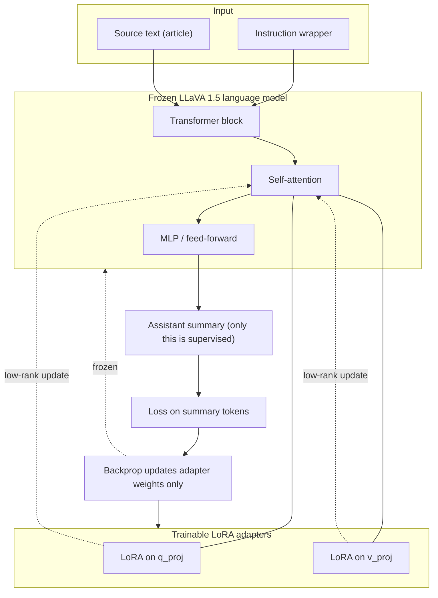
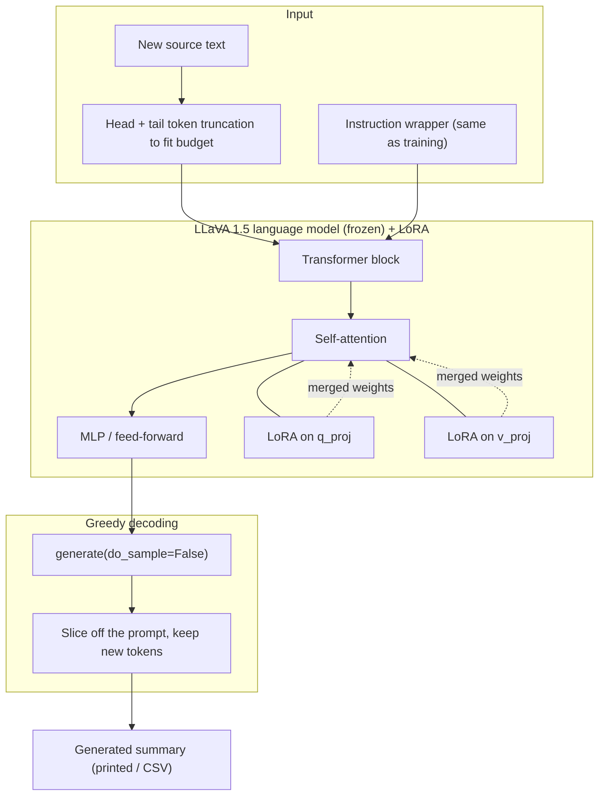

# LLaVA 1.5 7B LoRA training (text-only source text → summary)

Model: `llava-hf/llava-1.5-7b-hf` (LoRA on the language backbone)
Data: CNN/DailyMail article/summary pairs, downloaded locally as Parquet. This
repo does not download CNN/DailyMail itself; it only trains on the files once
you've fetched them. All downloads, cache, checkpoints, and adapters stay
inside this folder.

**Task:** given an article's raw text, produce a new one-paragraph summary.
No image is used — this is a pure text model. Loss is computed only on the
summary, and long input is truncated by tokens (head + tail) so the summary
is always preserved in the training budget.

## Dataset — CNN/DailyMail

[`abisee/cnn_dailymail`](https://huggingface.co/datasets/abisee/cnn_dailymail)
(config `3.0.0`), a public, no-setup-required news-summarization dataset.
`axolotl-ocr-summary/` is untouched by this — it already accepts CNN/DailyMail
via `--text-col article --summary-col highlights` on its own CSV-based prep
script.

**Where the dataset lives:** downloaded locally to
`C:\Users\luisarandas\Desktop\cnn_dailymail\3.0.0\` (outside this repo, and
outside the root folder — not committed, not moved). Point `--cnn-dailymail-dir`
at wherever you keep it; nothing in this pipeline assumes a fixed location.

**Dataset format.** Hugging Face ships CNN/DailyMail as Parquet, split into
train/validation/test shards:

```
cnn_dailymail/3.0.0/
├── train-00000-of-00003.parquet   \
├── train-00001-of-00003.parquet    } 287,113 rows total, ~772 MB
├── train-00002-of-00003.parquet   /
├── validation-00000-of-00001.parquet   13,368 rows, ~35 MB
└── test-00000-of-00001.parquet         11,490 rows, ~30 MB
```

Total: **311,971 rows, ~799 MB on disk** (compressed Parquet; measured against
the files in the path above). Three columns per row:

| Column | Type | What it is | Typical length |
|---|---|---|---|
| `article` | string | Full news article body | ~3,950 chars avg (106–12,027 range) |
| `highlights` | string | Human-written multi-sentence summary (the training target) | ~260 chars avg (34–1,123 range) |
| `id` | string | SHA1 hash of the source URL | — |

`build_llava15_dataset.py --cnn-dailymail-dir <dir>` maps this straight onto
the JSONL contract the trainer reads: `article -> text`, `highlights ->
summary` — each record also carries `"source": "cnn_dailymail"` and the
original `id` so it's traceable back to the source row.

**Size guidance for a single RTX 3090 (24GB):** the full 287k-row train split
is far more than a LoRA on 2 attention projections needs and would take many
hours per epoch. Start with `--max-samples` in the low thousands (e.g.
1,000–5,000) for a real training run, or 256 for the smoke test in step 3 —
scale up only if loss/eval curves justify it.

### 1) Install deps (once)

```bash
uv_setup.bat
```

This installs project dependencies (including `transformers`, `peft`,
`accelerate`, `sentencepiece`, `pandas`, `pyarrow`) through `uv sync`.

### 2) Build JSONL dataset

Point `--cnn-dailymail-dir` at the local Parquet folder, cap rows with
`--max-samples` (recommended, see sizing above):

```bash
.venv\Scripts\python.exe build_llava15_dataset.py --cnn-dailymail-dir "C:\Users\luisarandas\Desktop\cnn_dailymail\3.0.0" --cnn-dailymail-split train --max-samples 2000
```

or from the repo root without activating the venv:

```bash
uv run --directory fine-tuning/llava15-lora python build_llava15_dataset.py --cnn-dailymail-dir "C:\Users\luisarandas\Desktop\cnn_dailymail\3.0.0" --cnn-dailymail-split train --max-samples 2000
```

Output is `data/llava15_train.jsonl`. Training consumes the `text` and
`summary` fields (`prompt`/`source`/`id` are kept for reference but are
ignored by the text-only trainer).

### 3) Smoke test (must pass before a full run)

```bash
.venv\Scripts\python.exe train_llava15_lora.py --max-samples 256 --num-epochs 1
```

The trainer's default `--instruction` already matches the prompt
`build_llava15_dataset.py` used to build the JSONL, so nothing extra is
needed for CNN/DailyMail. Only pass `--instruction` if you're training on
differently-worded source text.

Expected: train loss decreases and `eval_loss` is numeric (not `nan`).

### Training View

The frozen LLaVA 1.5 language backbone gets LoRA adapters on the attention
projections (`q_proj`, `v_proj`). Only the adapter weights update during
backprop; the base weights stay fixed. The vision encoder is not exercised — the
prompt is text only (`USER: <instruction + source text> ASSISTANT: <summary>`),
and the loss is masked so it covers the summary tokens only.



### 4) Full training with checkpoints

Fresh one-epoch run (writes `checkpoint-917`, evaluates, saves `final_adapter/`):

```bash
.venv\Scripts\python.exe train_llava15_lora.py --num-epochs 1 --output-dir runs/llava15_lora
```

**Resume and train more epochs.** `--resume-from-checkpoint last` picks up the
newest `checkpoint-*` in the output dir; `--extra-epochs N` adds `N` epochs *on
top of* the epoch already reached. So to take a 1-epoch run up to **3 epochs
total**, add 2:

```bash
.venv\Scripts\python.exe train_llava15_lora.py --output-dir runs/llava15_lora --resume-from-checkpoint last --extra-epochs 2
```

To then add one more (3 → 4 total):

```bash
.venv\Scripts\python.exe train_llava15_lora.py --output-dir runs/llava15_lora --resume-from-checkpoint last --extra-epochs 1
```

Or run all epochs in one shot instead of resuming:

```bash
.venv\Scripts\python.exe train_llava15_lora.py --num-epochs 3 --output-dir runs/llava15_lora
```

Checkpoint files are written under `runs/llava15_lora/`, including
`latest_checkpoint.txt`, `resume_command.txt` (a ready-to-paste resume line), and
`final_adapter/`. Note: on resume the learning-rate schedule is rebuilt for the
new total epoch count, so the LR steps back up at restart and the loss may tick
up briefly before continuing to fall — this is expected.

### 5) Generate a summary from new source text

This is the main use case: paste **new** raw source text and get a **new**
summary. No image and no CSV are needed.

#### Inference View

At inference the base LLaVA language model is reloaded and the trained LoRA
adapter is merged on top of `q_proj`/`v_proj`. There is **no loss, no backprop,
and no vision tower** — the source text is wrapped in the same instruction, fed
through the frozen+adapted backbone, and the model decodes only the new
ASSISTANT tokens (greedy, `do_sample=False`). The blocks below are exactly what
`generate_llava15_lora.py` exercises.



Not used at inference: the vision encoder, the multimodal projector, label
masking, the optimizer, and the loss head.

Inline text:

```bash
.venv\Scripts\python.exe generate_llava15_lora.py --adapter-dir runs/llava15_lora/final_adapter --text "LONDON, England (Reuters) -- ... your raw article text here ..."
```

From a file (best for long articles — paste the text into a `.txt` first):

```bash
.venv\Scripts\python.exe generate_llava15_lora.py --adapter-dir runs/llava15_lora/final_adapter --text-file my_article.txt
```

The summary is printed to the console. Source text longer than the token
budget is automatically truncated head + tail so the most informative parts
are kept; nothing breaks on very long input.

### 6) Batch evaluate against reference summaries (optional)

Run the adapter over a source-text CSV and score it against reference
summaries. `--source-csv` needs a `text` column (and optionally `image`/
`status` columns, unused here but harmless if present); `--reference-csv`
needs a matching `summary` column:

```bash
.venv\Scripts\python.exe generate_llava15_lora.py --adapter-dir runs/llava15_lora/final_adapter --source-csv path\to\articles.csv --reference-csv path\to\references.csv --out-csv runs/llava15_lora/generated.csv --max-rows 200
```

What this gives you:
- `runs/llava15_lora/generated.csv` with one generated summary per row
- `runs/llava15_lora/generated_metrics.json` with counts and average token-F1 vs reference summaries

Track `avg_token_f1` across epochs as a quick quantitative trend, and skim
`generated.csv` to confirm the model now writes summaries (not echoes of the
source text).

## Serving

Once trained, serve the adapter with the FastAPI server in
[`../../serving/llava15-lora/`](../../serving/llava15-lora/README.md).
