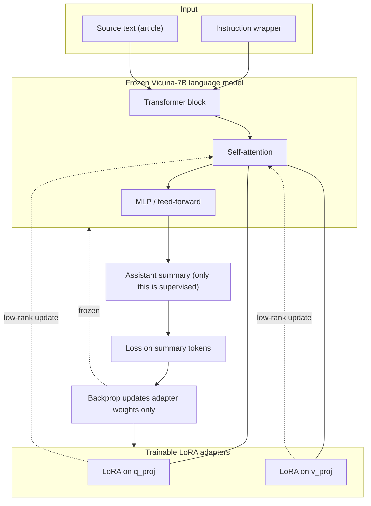
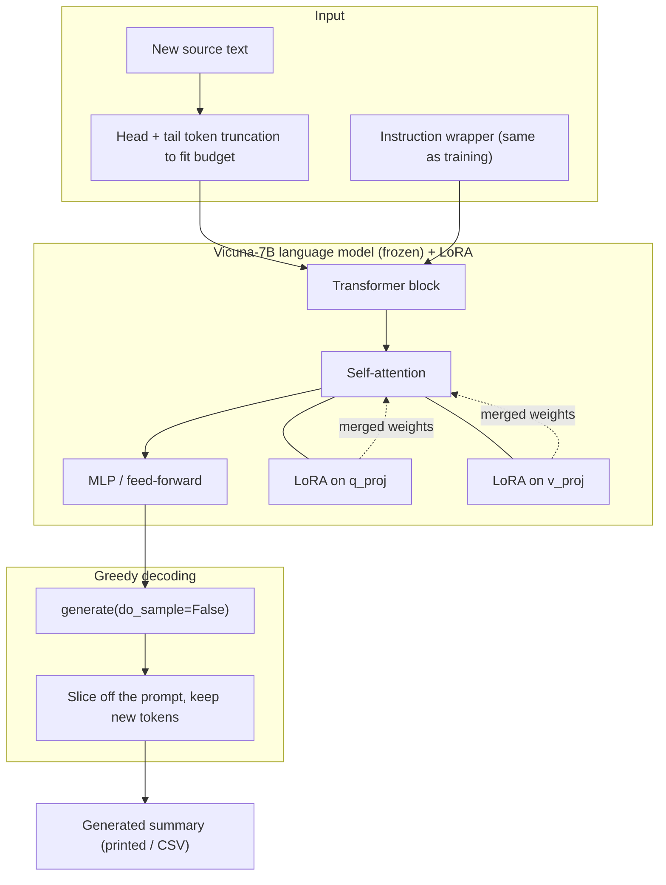

# vicuna-7b-lora

LoRA fine-tuning of **plain Vicuna-7B** (`lmsys/vicuna-7b-v1.5`) on text/summary
pairs. This loads only the language model — no LLaVA checkpoint, no vision
encoder, no multimodal projector, nothing image-related is ever downloaded or
touched. See [Why Vicuna-7B directly, not via LLaVA](#why-vicuna-7b-directly-not-via-llava)
below for the reasoning.

**Task:** given an article's raw text, produce a new one-paragraph summary.
Loss is computed only on the summary, and long input is truncated by tokens
(head + tail) so the summary is always preserved in the training budget.

**Data:** CNN/DailyMail article/summary pairs, downloaded locally as Parquet.
This repo does not download CNN/DailyMail itself; it only trains on the files
once you've fetched them. All downloads, cache, checkpoints, and adapters
stay inside this folder.

## Why Vicuna-7B directly, not via LLaVA

An earlier version of this pipeline (`llava15-lm-lora`) loaded
`llava-hf/llava-1.5-7b-hf` via `LlavaForConditionalGeneration` and only
LoRA'd its language-model submodule — functionally a Vicuna-7B fine-tune,
but it still downloaded and instantiated the full ~14 GB multimodal
checkpoint (vision encoder + projector included) to get there, and used
`AutoProcessor` where a plain tokenizer would do.

This pipeline loads `lmsys/vicuna-7b-v1.5` directly via
`AutoModelForCausalLM` + `AutoTokenizer` — the actual language-model
backbone LLaVA 1.5 was built from, with nothing extra:

- No vision encoder, no multimodal projector, no image-processing code path
  (`AutoProcessor`) in the dependency graph at all.
- ~13 GB download instead of ~14 GB, and a plain `LlamaForCausalLM` class
  instead of `LlavaForConditionalGeneration`.
- LoRA adapters still target `q_proj`/`v_proj` in the attention layers —
  same LoRA config, same task, simpler stack underneath.

Trade-off worth knowing: `lmsys/vicuna-7b-v1.5` is the base checkpoint
LLaVA 1.5 was later visually-instruction-tuned from, not a checkpoint that
has been through LLaVA's own fine-tuning. In practice this means slightly
different starting weights than the old `llava15-lm-lora` pipeline used —
not directly comparable results, but a cleaner, smaller, more honestly-named
starting point for a *language-model-only* LoRA.

A future `llava15-full-lora` pipeline, trained on image+text pairs and
actually exercising the vision encoder/projector, remains the natural next
step for a real VLM fine-tune in this repo — that one *should* load the full
LLaVA checkpoint, since it needs the vision side.

## Dataset — CNN/DailyMail

[`abisee/cnn_dailymail`](https://huggingface.co/datasets/abisee/cnn_dailymail)
(config `3.0.0`), a public, no-setup-required news-summarization dataset.
Same source [`../qwen25-3b-lora/`](../qwen25-3b-lora/README.md) trains on.

**Where the dataset lives:** downloaded locally to
`C:\Users\luisarandas\Desktop\cnn_dailymail\3.0.0\` (outside this repo, and
outside the root folder — not committed, not moved). Point `--cnn-dailymail-dir`
at wherever you keep it; nothing in this pipeline assumes a fixed location.

**Dataset format.** Hugging Face ships CNN/DailyMail as Parquet, split into
train/validation/test shards:

```
cnn_dailymail/3.0.0/
├── train-00000-of-00003.parquet   \
├── train-00001-of-00003.parquet    } 287,113 rows total, ~772 MB
├── train-00002-of-00003.parquet   /
├── validation-00000-of-00001.parquet   13,368 rows, ~35 MB
└── test-00000-of-00001.parquet         11,490 rows, ~30 MB
```

Total: **311,971 rows, ~799 MB on disk** (compressed Parquet). Three columns
per row:

| Column | Type | What it is | Typical length |
|---|---|---|---|
| `article` | string | Full news article body | ~3,950 chars avg (106–12,027 range) |
| `highlights` | string | Human-written multi-sentence summary (the training target) | ~260 chars avg (34–1,123 range) |
| `id` | string | SHA1 hash of the source URL | — |

`build_vicuna7b_dataset.py --cnn-dailymail-dir <dir>` maps this onto the
JSONL contract the trainer reads: `article -> text`, `highlights ->
summary` — each record also carries `"source": "cnn_dailymail"` and the
original `id` for traceability.

**Why `--max-samples` instead of the full 287k-row train split:** at ~4s per
optimizer step (batch=1 × grad-accum=4 → 1 step per 4 samples), a full epoch
over 287,113 rows is roughly **74 GPU-hours** on a single RTX 3090 — not a
data limitation, a deliberate time/size trade-off. Start with `--max-samples`
in the low thousands (1,000–5,000) for a real run, or 256 for the smoke test
in step 3, and raise it only if you're willing to spend the extra GPU-hours
(scales roughly linearly: 20,000 samples × 2 epochs ≈ 10 hours).

## 1) Install deps (once)

```bash
uv_setup.bat
```

Installs project dependencies (`transformers`, `peft`, `accelerate`,
`sentencepiece`, `protobuf`, `pandas`, `pyarrow`) through `uv sync`.
`protobuf` matters here specifically: `lmsys/vicuna-7b-v1.5` ships a raw
SentencePiece tokenizer, and converting it to a fast tokenizer needs
`protobuf` — without it, `AutoTokenizer.from_pretrained` fails outright
(it falls through to a `tiktoken`-based path that also isn't installed).

## 2) Build JSONL dataset

Point `--cnn-dailymail-dir` at the local Parquet folder, cap rows with
`--max-samples` (recommended, see sizing above):

```bash
uv run --directory fine-tuning/vicuna-7b-lora python build_vicuna7b_dataset.py --cnn-dailymail-dir "C:\Users\luisarandas\Desktop\cnn_dailymail\3.0.0" --cnn-dailymail-split train --max-samples 2000
```

Output is `data/vicuna7b_train.jsonl`. Training consumes the `text` and
`summary` fields (`prompt`/`source`/`id` are kept for reference but ignored
by the trainer).

## 3) Smoke test (must pass before a full run)

```bash
uv run --directory fine-tuning/vicuna-7b-lora python train_vicuna7b_lora.py --max-samples 256 --num-epochs 1
```

The trainer's default `--instruction` already matches the prompt
`build_vicuna7b_dataset.py` used to build the JSONL, so nothing extra is
needed for CNN/DailyMail. Only pass `--instruction` if training on
differently-worded source text.

Expected: train loss decreases and `eval_loss` is numeric (not `nan`).
Verified end-to-end this pass (model load, LoRA attach, training loop, save)
against a 40-sample run.

### Training view

Vicuna-7B (a plain causal LM) gets LoRA adapters on the attention
projections (`q_proj`, `v_proj`). Only the adapter weights update during
backprop; the base weights stay fixed. There is no vision component in the
graph at all — the prompt is text only
(`USER: <instruction + source text> ASSISTANT: <summary>`), and the loss is
masked so it covers the summary tokens only.



## 4) Full training with checkpoints

Fresh one-epoch run (evaluates, saves `final_adapter/`):

```bash
uv run --directory fine-tuning/vicuna-7b-lora python train_vicuna7b_lora.py --num-epochs 1 --output-dir runs/vicuna7b_lora
```

**Resume and train more epochs.** `--resume-from-checkpoint last` picks up the
newest `checkpoint-*` in the output dir; `--extra-epochs N` adds `N` epochs
*on top of* the epoch already reached. To take a 1-epoch run to **3 epochs
total**, add 2:

```bash
uv run --directory fine-tuning/vicuna-7b-lora python train_vicuna7b_lora.py --output-dir runs/vicuna7b_lora --resume-from-checkpoint last --extra-epochs 2
```

Or run all epochs in one shot instead of resuming:

```bash
uv run --directory fine-tuning/vicuna-7b-lora python train_vicuna7b_lora.py --num-epochs 3 --output-dir runs/vicuna7b_lora
```

Checkpoint files are written under `runs/vicuna7b_lora/`, including
`latest_checkpoint.txt`, `resume_command.txt` (a ready-to-paste resume line),
and `final_adapter/`. Note: on resume the learning-rate schedule is rebuilt
for the new total epoch count, so the LR steps back up at restart and the
loss may tick up briefly before continuing to fall — expected.

**Reading the loss curve:** on the previous (now-superseded) `llava15-lm-lora`
pipeline, a 2,000-sample/1-epoch run dropped loss sharply in the first ~50
steps then plateaued in a noisy band for the rest of the run, with
`eval_loss` tracking train loss closely (no overfitting). That's the normal
shape for a rank-16, 2-projection adapter on a small dataset with effective
batch size 4 — don't read a plateau as a broken run. **Loss alone doesn't
tell you if the summaries are good — verify with the reconstruction test
below.**

## 5) Reconstruction test — verify quality, not just loss

Print N held-out examples (input / reference summary / generated summary
side by side) instead of guessing from the loss curve. This replicates
`train_vicuna7b_lora.py`'s train/val split (same `--seed`/`--val-ratio`), so
these are genuinely unseen examples, not training-set echoes:

```bash
uv run --directory fine-tuning/vicuna-7b-lora python generate_vicuna7b_lora.py --adapter-dir runs/vicuna7b_lora/final_adapter --jsonl-eval data/vicuna7b_train.jsonl --num-samples 5
```

Read the printed pairs, don't just look at the token-F1 number — it's a
rough word-overlap proxy, so a coherent, accurate, on-topic summary with a
*low* F1 usually just means the model paraphrased instead of reusing
reference wording, which is fine for an abstractive summarizer.

## 6) Generate a summary from new source text

For arbitrary new input (not a dataset sample):

```bash
uv run --directory fine-tuning/vicuna-7b-lora python generate_vicuna7b_lora.py --adapter-dir runs/vicuna7b_lora/final_adapter --text "LONDON, England (Reuters) -- ... your raw article text here ..."
```

From a file (best for long articles — paste the text into a `.txt` first):

```bash
uv run --directory fine-tuning/vicuna-7b-lora python generate_vicuna7b_lora.py --adapter-dir runs/vicuna7b_lora/final_adapter --text-file my_article.txt
```

The summary is printed to the console. Source text longer than the token
budget is automatically truncated head + tail so the most informative parts
are kept; nothing breaks on very long input.

### Inference view

At inference Vicuna-7B is reloaded and the trained LoRA adapter is merged on
top of `q_proj`/`v_proj`. There is **no loss, no backprop** — the source text
is wrapped in the same instruction, fed through the frozen+adapted model,
and it decodes only the new ASSISTANT tokens (greedy, `do_sample=False`).



Not used at inference (or anywhere in this pipeline): a vision encoder, a
multimodal projector, label masking, the optimizer, and the loss head.

## 7) Batch evaluate against reference summaries (optional)

Run the adapter over a source-text CSV and score it against reference
summaries. `--source-csv` needs a `text` column (and optionally `image`/
`status` columns, unused here but harmless if present); `--reference-csv`
needs a matching `summary` column:

```bash
uv run --directory fine-tuning/vicuna-7b-lora python generate_vicuna7b_lora.py --adapter-dir runs/vicuna7b_lora/final_adapter --source-csv path\to\articles.csv --reference-csv path\to\references.csv --out-csv runs/vicuna7b_lora/generated.csv --max-rows 200
```

What this gives you:
- `runs/vicuna7b_lora/generated.csv` with one generated summary per row
- `runs/vicuna7b_lora/generated_metrics.json` with counts and average token-F1 vs reference summaries

Track `avg_token_f1` across epochs as a quick quantitative trend alongside
the reconstruction test in step 5.

## Serving

No serving folder for this pipeline right now —
`../../serving/vicuna-7b-lora/`, a FastAPI server that loaded the base model
plus this adapter, was removed by the repo owner. `merge_adapter.py` here
still produces a standalone merged model, which is what any replacement
server would load. See [`../../serving/README.md`](../../serving/README.md).
