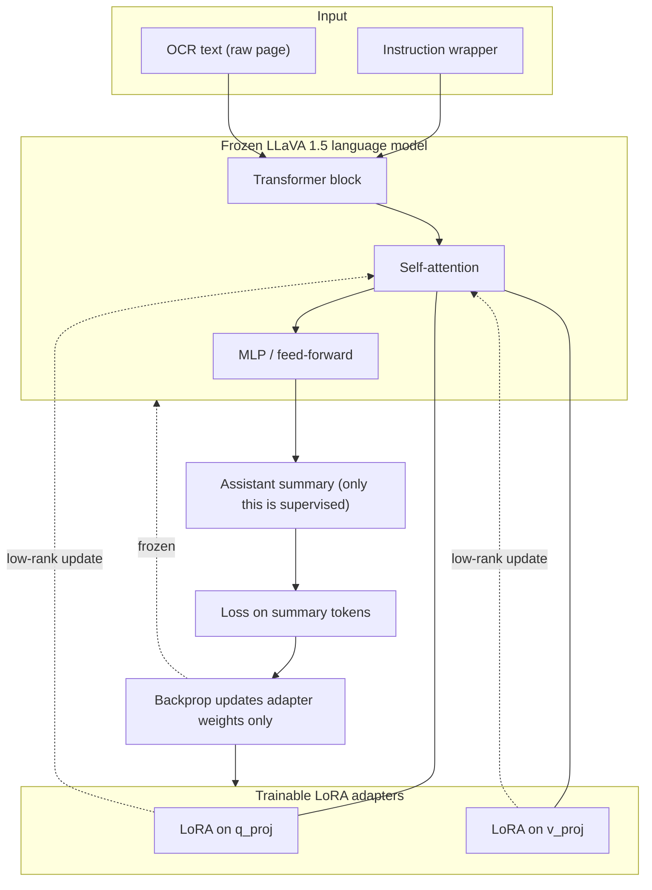
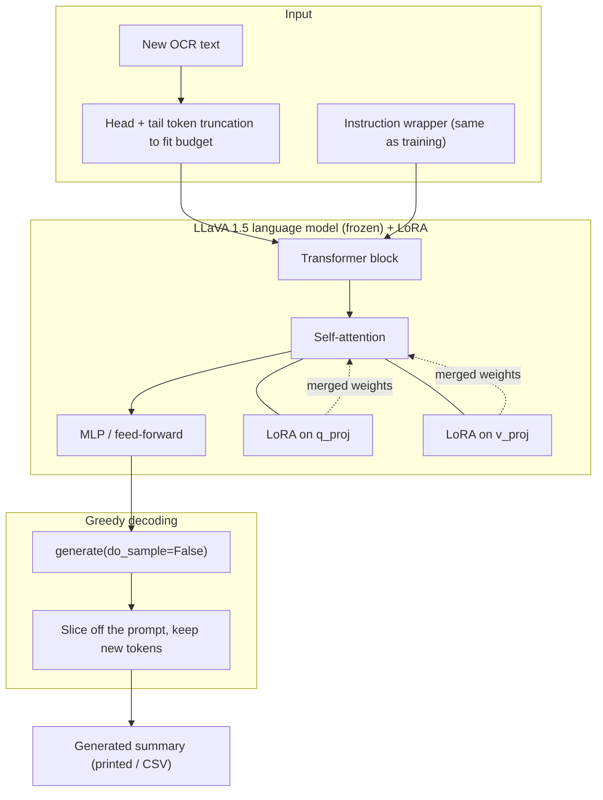

# LLaVA 1.5 7B LoRA training (text-only OCR → summary)

Model: `llava-hf/llava-1.5-7b-hf` (LoRA on the language backbone)
Data: OCR text + reference summaries from the [pre-training](https://github.com/vecnode/pre-training)
repo's `outputs/[timestamp]_[dataset]/[timestamp]_[dataset]-OCR.csv` /
`-SUMMARIES.csv` — this repo does not run OCR or generate summaries itself,
it only trains on CSVs produced elsewhere.
All downloads, cache, checkpoints, and adapters stay inside this folder.

**Task:** given the raw OCR text of a page, produce a new one-paragraph summary.
The page image is **not** used — the OCR text already carries the signal, so we
train the LLaVA language model as a pure text model. Loss is computed only on the
summary, and long OCR is truncated by tokens (head + tail) so the summary is
always preserved in the training budget.

### 1) Install deps (once)

```bash
uv_setup.bat
```

This installs project dependencies (including `transformers`, `peft`, `accelerate`, `sentencepiece`) through `uv sync`.

### 2) Build JSONL dataset

Point `--ocr-csv` / `--summaries-csv` at the pre-training repo's per-run
output files (the OCR CSV's `full_path` column is already absolute, so no
`--root` juggling is needed):

```bash
.venv\Scripts\python.exe build_llava15_dataset.py --ocr-csv "C:\path\to\pre-training\outputs\[timestamp]_[dataset]\[timestamp]_[dataset]-OCR.csv" --summaries-csv "C:\path\to\pre-training\outputs\[timestamp]_[dataset]\[timestamp]_[dataset]-SUMMARIES.csv"
```

Output: `data/llava15_train.jsonl`. Training consumes the `ocr_text` and
`summary` fields (the `image_path`/`prompt` fields are kept for reference but are
ignored by the text-only trainer).

### 3) Smoke test (must pass before a full run)

```bash
.venv\Scripts\python.exe train_llava15_lora.py --max-samples 256 --num-epochs 1
```

Expected: train loss decreases and `eval_loss` is numeric (not `nan`).

### Training View

The frozen LLaVA 1.5 language backbone gets LoRA adapters on the attention
projections (`q_proj`, `v_proj`). Only the adapter weights update during
backprop; the base weights stay fixed. The vision encoder is not exercised — the
prompt is text only (`USER: <instruction + OCR> ASSISTANT: <summary>`), and the
loss is masked so it covers the summary tokens only.



### 4) Full training with checkpoints

Fresh one-epoch run (writes `checkpoint-917`, evaluates, saves `final_adapter/`):

```bash
.venv\Scripts\python.exe train_llava15_lora.py --num-epochs 1 --output-dir runs/llava15_lora
```

**Resume and train more epochs.** `--resume-from-checkpoint last` picks up the
newest `checkpoint-*` in the output dir; `--extra-epochs N` adds `N` epochs *on
top of* the epoch already reached. So to take a 1-epoch run up to **3 epochs
total**, add 2:

```bash
.venv\Scripts\python.exe train_llava15_lora.py --output-dir runs/llava15_lora --resume-from-checkpoint last --extra-epochs 2
```

To then add one more (3 → 4 total):

```bash
.venv\Scripts\python.exe train_llava15_lora.py --output-dir runs/llava15_lora --resume-from-checkpoint last --extra-epochs 1
```

Or run all epochs in one shot instead of resuming:

```bash
.venv\Scripts\python.exe train_llava15_lora.py --num-epochs 3 --output-dir runs/llava15_lora
```

Checkpoint files are written under `runs/llava15_lora/`, including
`latest_checkpoint.txt`, `resume_command.txt` (a ready-to-paste resume line), and
`final_adapter/`. Note: on resume the learning-rate schedule is rebuilt for the
new total epoch count, so the LR steps back up at restart and the loss may tick
up briefly before continuing to fall — this is expected.

### 5) Generate a summary from new OCR text

This is the main use case: paste **new** raw OCR text and get a **new** summary.
No image and no CSV are needed.

#### Inference View

At inference the base LLaVA language model is reloaded and the trained LoRA
adapter is merged on top of `q_proj`/`v_proj`. There is **no loss, no backprop,
and no vision tower** — the OCR text is wrapped in the same instruction, fed
through the frozen+adapted backbone, and the model decodes only the new
ASSISTANT tokens (greedy, `do_sample=False`). The blocks below are exactly what
`generate_llava15_lora.py` exercises.



Not used at inference: the vision encoder, the multimodal projector, label
masking, the optimizer, and the loss head.

Inline text:

```bash
.venv\Scripts\python.exe generate_llava15_lora.py --adapter-dir runs/llava15_lora/final_adapter --ocr-text "CONFIDENTIAL ... your raw OCR characters here ..."
```

From a file (best for long pages — paste the OCR into a `.txt` first):

```bash
.venv\Scripts\python.exe generate_llava15_lora.py --adapter-dir runs/llava15_lora/final_adapter --ocr-text-file my_page.txt
```

The summary is printed to the console. OCR that is longer than the token budget
is automatically truncated head + tail so the most informative parts of the page
are kept; nothing breaks on very long input.

### 6) Batch evaluate against reference summaries (optional)

Run the adapter over an OCR CSV and score it against your reference summaries
(again pointing at the pre-training repo's per-run CSVs):

```bash
.venv\Scripts\python.exe generate_llava15_lora.py --adapter-dir runs/llava15_lora/final_adapter --ocr-csv "C:\path\to\pre-training\outputs\[timestamp]_[dataset]\[timestamp]_[dataset]-OCR.csv" --reference-csv "C:\path\to\pre-training\outputs\[timestamp]_[dataset]\[timestamp]_[dataset]-SUMMARIES.csv" --out-csv runs/llava15_lora/generated.csv --max-rows 200
```

What this gives you:
- `runs/llava15_lora/generated.csv` with one generated summary per page
- `runs/llava15_lora/generated_metrics.json` with counts and average token-F1 vs reference summaries

Track `avg_token_f1` across epochs as a quick quantitative trend, and skim
`generated.csv` to confirm the model now writes summaries (not echoes of the OCR).

## Serving

Once trained, serve the adapter with the FastAPI server in
[`../deploy/llava15-lora/`](../deploy/llava15-lora/README.md).
